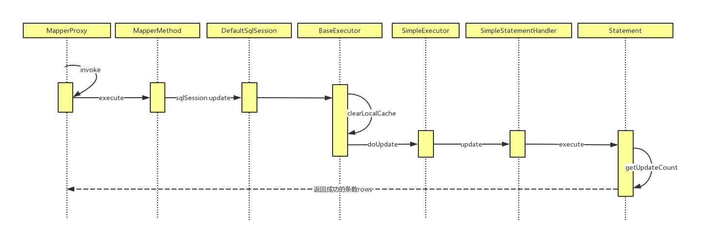

##mybatis中用到的设计模式

- 装饰者模式：cachingExceutord对Execctor进行包装
- 建造模式：SqlSessionFactoryBuilder去创建SqlSessionFactory，
- 工厂模式：sqlsessionfactory
- 模板方法模式：BaseExecutor、SimpleExecutor
- 动态代理：MapperProxy
- 委派模式：createCacheKey
- 责任链模式：Executor、StatmentHandler、ParameterHandler、ResultSetHandler组装成InterceptorChain

##mybatis中update操作时序图

